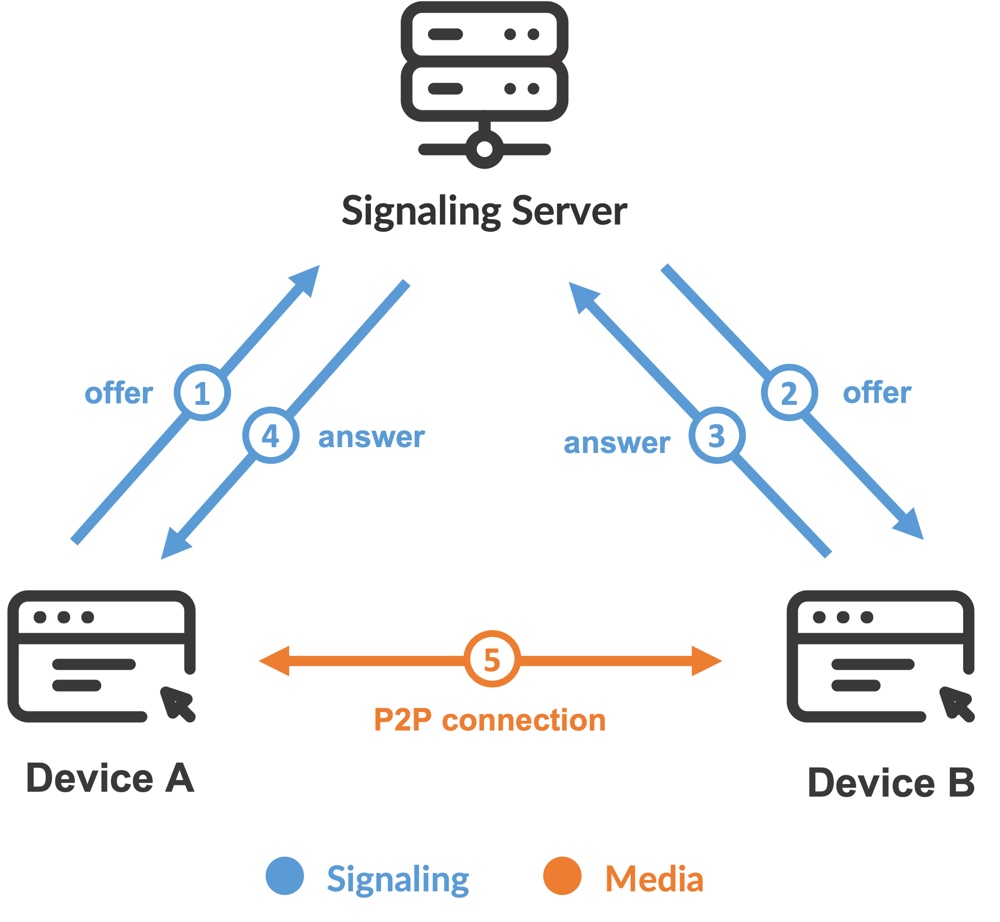

# DateVerse

DateVerse 是一個創新的交友平台，致力於利用最新技術打造全新的人際互動體驗。這個平台由三大核心構成：

1. **AR/VR 模組**  
   利用擴增實境（AR）和虛擬實境（VR）技術，提供用戶沉浸式的交友體驗。無論是透過 AR 探索周邊的用戶，還是進入虛擬空間進行互動，DateVerse 都能讓你身臨其境地感受彼此的存在。

2. **WebRTC 通訊**  
   實時通訊是 DateVerse 的重要組成部分，基於 WebRTC 技術實現高效、安全的視頻與語音通話，讓用戶可以隨時隨地進行即時溝通和連接。

   
   > 上圖示範了在 P2P 連線之前，雙方透過 Signaling Server 交換 offer 與 answer，最後建立起點對點的影音流。

3. **AI 聊天助手**  
   內置的 AI 聊天助手能夠根據用戶的對話內容提供智能回應和建議，幫助用戶打破沉默，促進更自然、更有趣的對話互動。

DateVerse 將這三大技術完美整合，致力於創造一個既前衛又人性化的交友生態系統，讓每一段緣分都充滿可能性。
